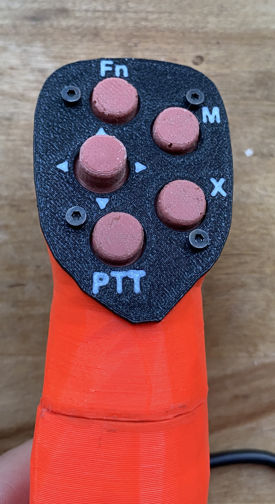

# Remote-Stick-with-ESP32
Remote Stick working as HID (Keybaord and Mouse) for Open Vario / Open Soar.
Can also used for DIY Keyboards and Mouse Emulation with Keys.

uC ESP32-S2  
uC Board: Lolin S2 mini  
<b>  Keep in Mind: ESP32: Only pins that support both input & output have integrated pull-up and pull-down resistors. Input-only GPIOs 34-39 do not. </b>

The buttons are read in with Interrupt-Routines. The ESP32-S2 has one core, with 32 interrupts.  
The buttons cann be pressed short, long (1sec) or very long (4sec),  
The pressing times are customizable.

| Button        | Pin | Mode: Joystick   | Mode: Mouse      | Remark  
| ------------- | --- | -------------    | -------------    | ------------- 
| HAT-Key Up    | 17  |KEY_UP_ARROW      | move mouse up    | -
| HAT-Key Down  | 21  |KEY_DOWN_ARROW    | move mouse down  | -
| HAT-Key Left  | 18  |KEY_LEFT_ARROW    | move mouse left  | -
| HAT-Key Right | 33  |KEY_RIGHT_ARROW   | move mouse right | -
| HAT-Key Press | 16  |KEY_RETURN        | mouse left click | -
| Fn            | 34  |Switch Mode       | -                | switches between mouse and keyboard emulation
| M             | 35  |1 1 3 3 3 4 4 4 4 | -                | cycle through Menue and switch Mode to Mouse
| X             | 36  |KEY_ESC           | -                | -

</b>

  * <b>Fn</b> : switches between mouse and keyboard emulation, **a long pressure ( > 1 Sec) sends a 'E' - could be managed as PilotEvent**
     in the XCSoar/OpenSoar - or to another user defined event in the xci-file
  * <b>M</b> : call the QuickMenu ('F1'), long pressure (> 1 sec) Audio/Vario-Menu ('M')
  * <b>X</b> : is ESC, **a long pressure calls the Quit program command ('Q'), and a very long pressure ( > 4 sec) sends a 'X' - can be used as exit command or for a shutdown event**
  * <b>Stick up down left right </b> :  are arrow keys **with an accelerated movement **
  * <b>Stick Press</b> : is Enter or Left Mouse Click
  
  * <b>PTT</b> : is an additional button connected to the PTT (not managed by the RemoteControl itself)
  * <b>9 (STF)</b> (out of this layout): is a button (backside of stick) for toggling between Vario and STF (Speed-to-Fly) mode

