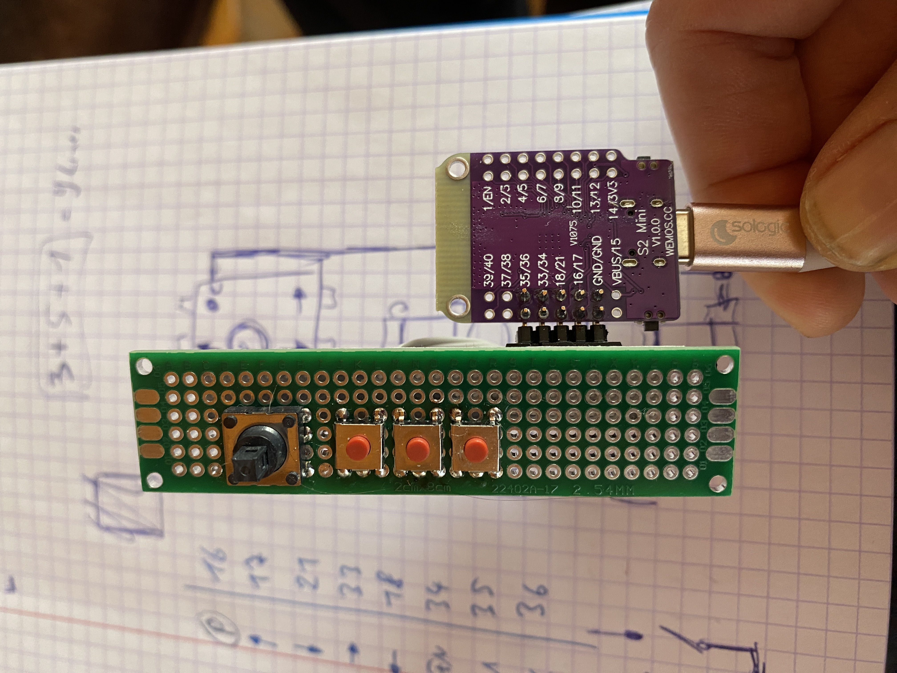
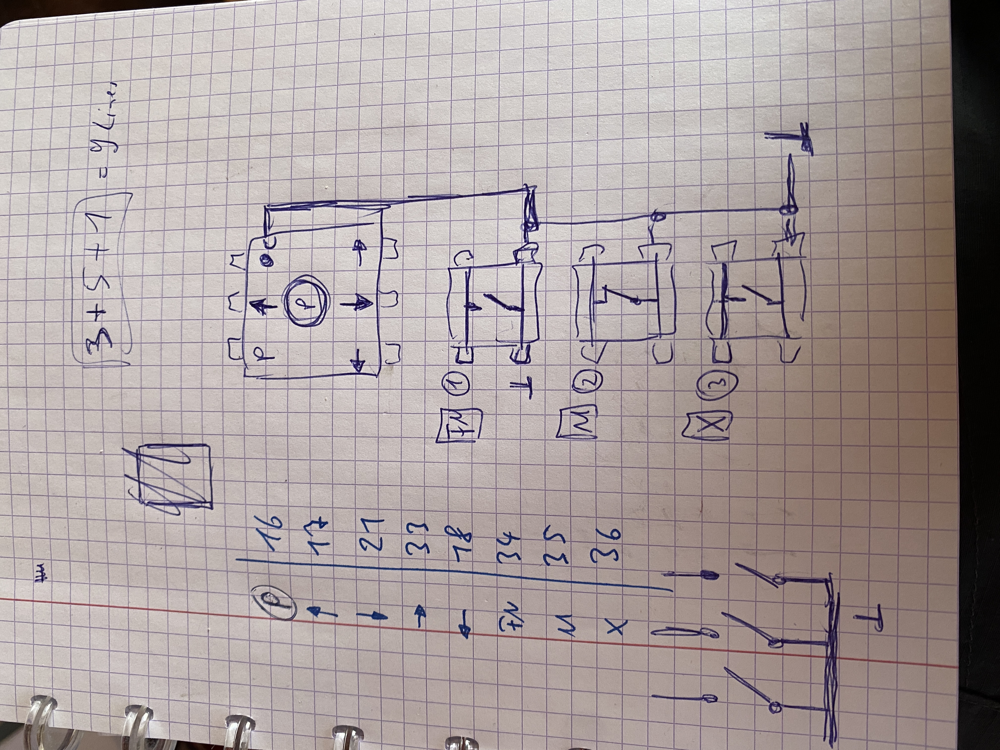

# Remote-Stick-with-ESP32
Remote Stick working as HID (Keybaord and mouse) for Open Vario / Open Soar.
Can also uesd for DIY Keyboards and Mouse Emulation with Keys.

Work in Progress!!!
uC ESP32-S2
uC Board: Lolin S2 mini

The buttons are read in with Interrupt-Routines. The ESP32 has 32 Interrupt Routines possible.
The buttons cann be pressed short, long (1sec) or very long (4sec)
The pressing times are customizable.

